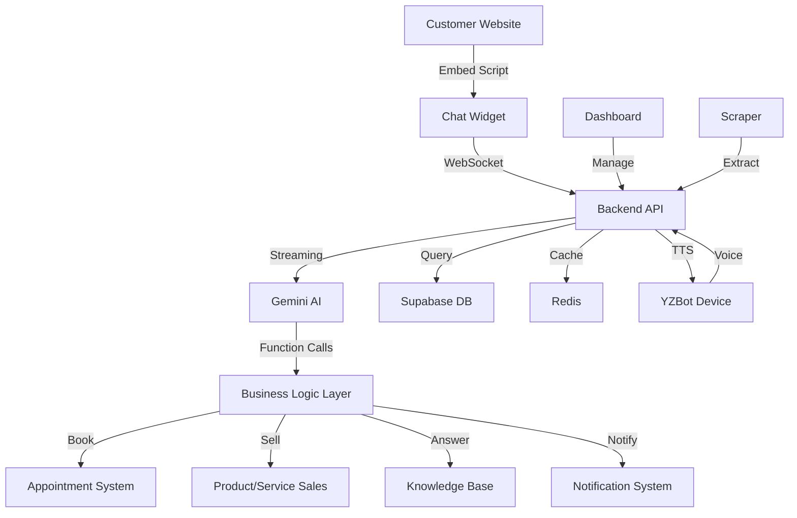

<div align="center">

<!-- Language Selector -->
<p align="right">
  <a href="README.md">🇬🇧 English</a> • <a href="README_TR.md">🇹🇷 Türkçe</a>
</p>

<!-- Logo and Title Side by Side -->
<table border="0" cellpadding="0" cellspacing="0" style="border: none;">
  <tr>
    <td align="center" valign="middle" style="border: none;">
      <!-- Animated Mascot Logo -->
      <svg width="100" height="100" viewBox="0 0 120 120" xmlns="http://www.w3.org/2000/svg">
        <defs>
          <linearGradient id="bodyGradient" x1="0%" y1="0%" x2="100%" y2="100%">
            <stop offset="0%" style="stop-color:#6366f1;stop-opacity:1" />
            <stop offset="100%" style="stop-color:#7c3aed;stop-opacity:1" />
          </linearGradient>
          <filter id="glow">
            <feGaussianBlur stdDeviation="3" result="coloredBlur"/>
            <feMerge>
              <feMergeNode in="coloredBlur"/>
              <feMergeNode in="SourceGraphic"/>
            </feMerge>
          </filter>
        </defs>
        <circle cx="60" cy="60" r="55" fill="url(#bodyGradient)" opacity="0.95"/>
        <circle cx="60" cy="60" r="50" fill="rgba(0,0,0,0.2)" stroke="rgba(255,255,255,0.1)" stroke-width="1"/>
        <ellipse cx="60" cy="35" rx="40" ry="20" fill="rgba(255,255,255,0.15)"/>
        <ellipse cx="45" cy="60" rx="6" ry="8" fill="#06b6d4" filter="url(#glow)">
          <animate attributeName="ry" values="8;1;8;8;8" dur="4s" repeatCount="indefinite" keyTimes="0;0.05;0.1;0.8;1"/>
        </ellipse>
        <ellipse cx="75" cy="60" rx="6" ry="8" fill="#06b6d4" filter="url(#glow)">
          <animate attributeName="ry" values="8;1;8;8;8" dur="4s" repeatCount="indefinite" keyTimes="0;0.05;0.1;0.8;1"/>
        </ellipse>
      </svg>
    </td>
    <td align="left" valign="middle" style="border: none; padding-left: 20px;">
      <h1 style="margin: 0; font-size: 2.5em;">Yapay Zeka Chatbot</h1>
      <p style="margin: 5px 0 0 0; font-size: 1.1em; color: #666;">AI-Powered Chatbot Platform</p>
    </td>
  </tr>
</table>

<p><strong>Intelligent chatbot system with automated onboarding, multi-tenant architecture, and AI-driven customer service</strong></p>

[](https://opensource.org/licenses/MIT)
[](https://www.typescriptlang.org/)
[](https://nextjs.org/)
[](https://supabase.com/)
[](https://ai.google.dev/)

[Demo](#-demo) • [Features](#-features) • [Architecture](#-architecture) • [Quick Start](#-quick-start) • [Roadmap](#-roadmap)

</div>

---

## 🌟 Overview

Transform any business website into an intelligent AI chatbot in **under 5 minutes**. Our platform automatically scrapes, analyzes, and creates a custom chatbot that handles customer inquiries, books appointments, and provides 24/7 support.

**NEW:** Introducing **YZBot** - Turkey's first AI-powered physical assistant device for businesses! 🎙️

### 🎯 Problem We Solve

- **Manual Setup:** Traditional chatbots require weeks of manual configuration
- **Poor Context:** Generic responses that don't understand your business
- **No Integration:** Disconnected from your services and booking systems
- **High Cost:** Enterprise solutions cost $500-2000/month
- **No Voice Support:** Text-only chatbots miss walk-in customers

### ✨ Our Solution

- **5-Minute Setup:** AI-powered website scraping and automatic configuration
- **Smart Context:** Understands your services, pricing, and business logic
- **Native Integration:** Built-in appointment booking and CRM
- **Affordable:** Starting at $49/month (launching soon)
- **YZBot Device:** Physical voice assistant for in-store customer service (2026 Q2)

---

## 🚀 Demo

### Live Demo
🔗 **[Visit Website](https://www.yapayzekachatbot.com)** - Launching in 60 days!

### Platform Preview

<div align="center">


*AI-powered chatbot platform that transforms any business website into an intelligent assistant*

</div>

---

## ✨ Features

### 🤖 AI-Powered Core

- **Smart Website Scraping** - Automatically discovers and extracts business information
- **Gemini AI Integration** - Advanced natural language understanding
- **Dynamic Prompts** - Context-aware responses tailored to each business
- **Function Calling** - Native appointment booking, service queries, and more
- **Streaming Responses** - Real-time, chunk-by-chunk responses (SSE)
- **Voice Support** - Speech-to-text and text-to-speech for YZBot device

### 💼 Business Features

- **Multi-Tenant Architecture** - Serve unlimited businesses from one platform
- **Appointment System** - Conflict detection, availability checking, notifications
- **Product/Service Sales** - Direct selling through chat with payment integration
- **Offerings Management** - Unified system for services (appointments) and products (sales)
- **Knowledge Base** - FAQ management with semantic search
- **Analytics Dashboard** - Conversation metrics, customer insights, performance tracking
- **Live Chat Takeover** - Human agents can take over conversations seamlessly
- **Payment Integration** - Stripe, PayPal, local payment gateways (planned)

### 🎨 User Experience

- **Embeddable Widget** - Single-line integration for any website
- **YZBot Device** - Physical voice assistant for in-store service (NEW!)
- **Customizable Design** - Match your brand colors, logo, and style
- **Mobile-First** - Responsive design for all devices
- **Accessibility** - WCAG 2.1 AA compliant
- **Dark Mode** - Automatic theme switching

### 🔒 Enterprise-Grade

- **Row-Level Security** - Complete tenant isolation
- **Rate Limiting** - Prevent abuse and control costs
- **Prompt Injection Protection** - Advanced security measures
- **99.9% Uptime** - Production-ready infrastructure
- **GDPR Compliant** - Privacy-first architecture

---

## 🏗️ Architecture

### Tech Stack

```
Frontend:  Next.js 15 + React 19 + TypeScript + Tailwind CSS
Backend:   Node.js + Express + TypeScript
Database:  Supabase (PostgreSQL)
AI:        Google Gemini 2.5 Flash
Real-time: Socket.io + Server-Sent Events
Hosting:   Vercel + Cloudflare CDN
```

### System Architecture



### Database Schema

- **17 Tables** - Optimized for multi-tenancy
- **58 Indexes** - Sub-100ms query performance
- **RLS Policies** - Complete tenant isolation
- **Triggers** - Automatic data consistency

---

## 🚀 Quick Start

> **Note:** This project is currently in active development. Full source code will be released upon launch.

### For Sponsors & Contributors

We're actively seeking sponsors to help bring this platform to market. If you're interested in:
- **Sponsoring** the project
- **Early access** to the platform
- **Partnership** opportunities

Please check our [Sponsorship Opportunities](docs/sponsors/README.md) or contact us directly.

### Coming Soon (60 Days)

- ✅ Full source code release
- ✅ Detailed installation guide
- ✅ API documentation
- ✅ Widget integration examples
- ✅ Video tutorials

### Preview Access

Visit [www.yapayzekachatbot.com](https://www.yapayzekachatbot.com) to:
- See the platform in action
- Join the waitlist
- Get early bird pricing

---

## 📊 Current Status

### ✅ Completed (v0.2.0)

- [x] **Database Architecture** - 17 tables, 58 indexes, RLS policies
- [x] **AI Scraping System** - Smart discovery, page selection, data extraction
- [x] **Chatbot Core** - Gemini integration, streaming responses, conversation management
- [x] **API Endpoints** - 5 REST endpoints with SSE streaming
- [x] **System Prompt Builder** - Dynamic, tenant-specific prompts
- [x] **Appointment System** - Conflict detection, availability checking

### 🚧 In Progress (v0.3.0)

- [ ] **Premium Widget** - Modern UI, animations, file upload
- [ ] **Dashboard** - Bot configuration, analytics, live chat
- [ ] **Performance Optimization** - Redis cache, response time <200ms
- [ ] **Production Deployment** - CDN, load balancing, monitoring
- [ ] **YZBot Device** - Prototype design and firmware development

### 📅 Roadmap

**Q1 2026**
- [ ] Voice API endpoints (speech-to-text, text-to-speech)
- [ ] Multi-language support (10+ languages)
- [ ] Advanced analytics (sentiment analysis, topic clustering)
- [ ] WhatsApp/Telegram integration

**Q2 2026 - YZBot Launch** 🎙️
- [ ] YZBot device prototype (50 units)
- [ ] Pilot program (50 businesses)
- [ ] Mass production (5,000 units)
- [ ] Open-source hardware release

**Q3-Q4 2026**
- [ ] 5,000+ YZBot devices deployed
- [ ] White-label solution
- [ ] Global expansion (UK, Germany, MENA)
- [ ] Enterprise features

**2027 Goals**
- [ ] 20,000+ YZBot devices
- [ ] 25,000-35,000 paying businesses
- [ ] 1-1.5 Billion ₺ ARR
- [ ] Turkey's #1 AI chatbot platform

---

## 📈 Performance & Goals

### Technical Metrics

| Metric | Target | Current |
|--------|--------|---------|
| Response Time | <500ms | ~2-4s ⚠️ |
| Database Query | <100ms | ~50ms ✅ |
| Uptime | >99.9% | 100% ✅ |
| Error Rate | <0.1% | 0% ✅ |
| Concurrent Users | 1000+ | Testing |

### Business Goals (2026-2027)

| Metric | 2026 End | 2027 End |
|--------|----------|----------|
| **Software Only** | | |
| Paying Businesses | 4,500-6,000 | 15,000-20,000 |
| ARR | 45-60M ₺ | 200-300M ₺ |
| **Software + YZBot** | | |
| Paying Businesses | 6,000-8,000 | 25,000-35,000 |
| YZBot Devices Sold | 5,000+ | 20,000+ |
| Total ARR | 150-250M ₺ | **1-1.5B ₺** |
| Turkey Market Share | 50-60% | 75-85% |

**Impact:** YZBot device adds **2.5-3.5× growth multiplier** + **85%+ retention**

---

## 🤝 Contributing

We welcome contributions! Please see our [Contributing Guide](CONTRIBUTING.md) for details.

### Development Setup

```bash
# Install dependencies
npm install

# Run tests
npm test

# Run linter
npm run lint

# Build
npm run build
```

---

## 📄 License

This project is licensed under the MIT License - see the [LICENSE](LICENSE) file for details.

---

## 🙏 Acknowledgments

Built with amazing open-source technologies:

- [Next.js](https://nextjs.org/) - React framework
- [Supabase](https://supabase.com/) - Backend as a service
- [Gemini AI](https://ai.google.dev/) - Google's AI model
- [shadcn/ui](https://ui.shadcn.com/) - UI components
- [Tailwind CSS](https://tailwindcss.com/) - Styling

---

## 📞 Contact

- **Website:** [www.yapayzekachatbot.com](https://www.yapayzekachatbot.com) - Launching Soon!
- **GitHub:** [github.com/rehberim360/yapay-zeka-chatbot](https://github.com/rehberim360/yapay-zeka-chatbot)
- **Email:** info@yapayzekachatbot.com
- **Status:** 🚧 In Active Development - Launch in 60 Days!

---

## 🌟 Star History

[](https://star-history.com/#rehberim360/yapay-zeka-chatbot&Date)

---

<div align="center">

**Made with ❤️ in Turkey | [www.yapayzekachatbot.com](https://www.yapayzekachatbot.com)**

🚀 **Launching in 60 Days** | 🌟 **Star us on GitHub** | 💼 **[Seeking Sponsors](docs/sponsors/README.md)**

[⬆ back to top](#-ai-powered-chatbot-platform)

</div>

